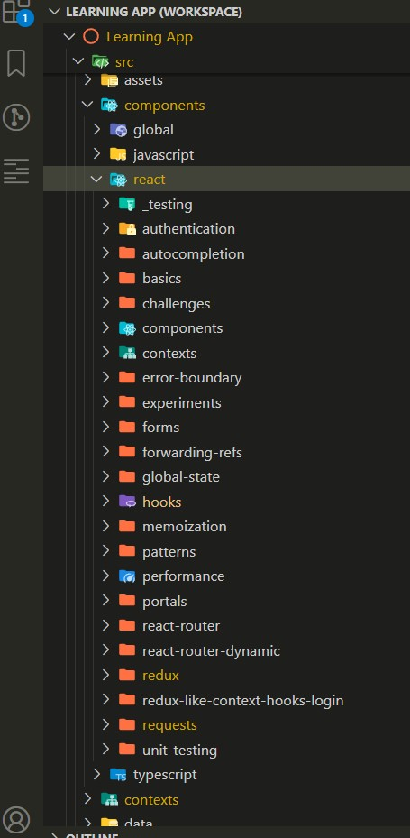
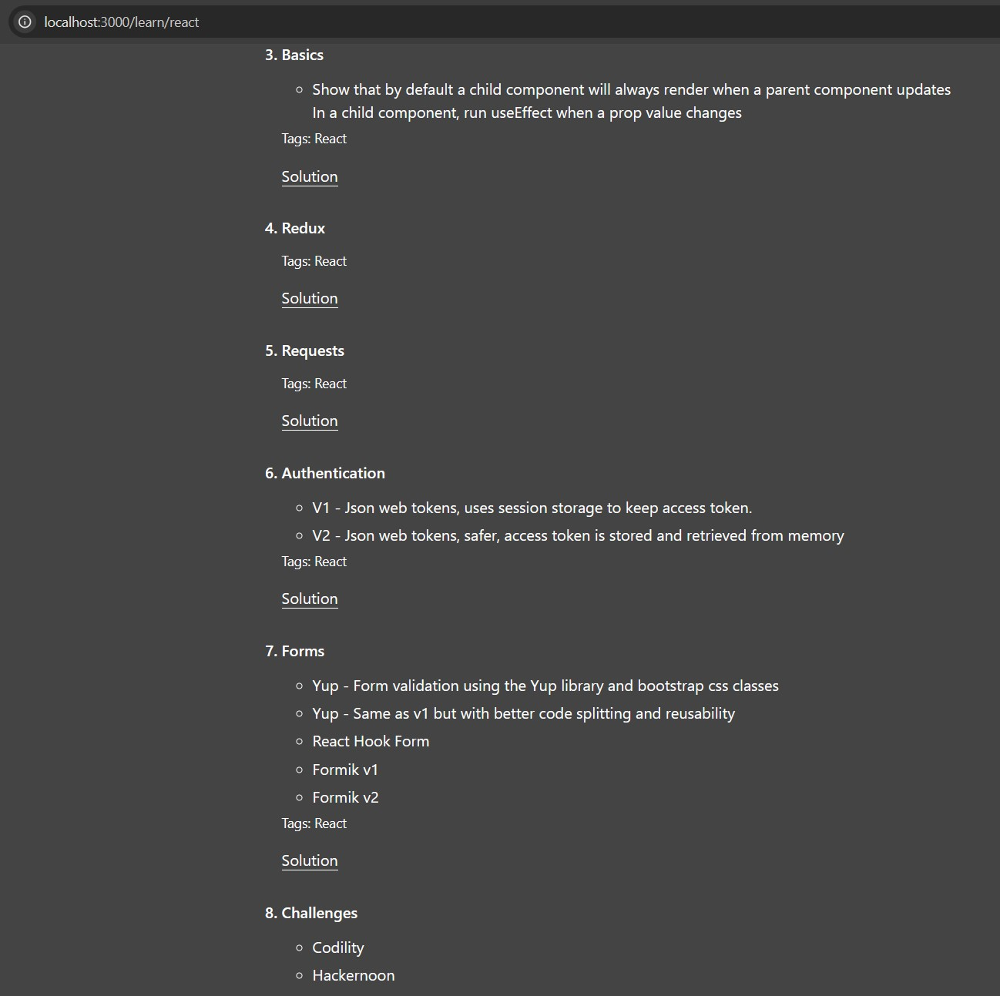

## About

This React application was developed as a learning tool and for testing React concepts. It functions as a codepen library, where each code snippet (or "codepen") is accessible via a list menu. The codepens are dynamically loaded and can be tested within the app, providing an interactive way to experiment with different code examples.

### `npm start`

Runs the app in the development mode.\
Open [http://localhost:3000](http://localhost:3000) to view it in your browser.

The page will reload when you make changes.\
You may also see any lint errors in the console.

### Folder Structure

<!--  -->

  
  

